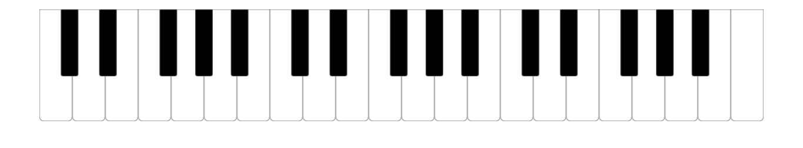

# Svelte Piano

This is a minimal piano interface built with Svelte.

## Demo

You can play around with the code on the [Svelte REPL](https://svelte.dev/repl/d0db1849a7f24d22a8dcc5b5a1a2b1bf?version=3.46.2).

## Features

-   The black keys are slightly shifted like in a real piano!
-   Supports both mouse and touch devices.
-   Uses standardized MIDI note numbers

## Documentation

To generate the UI, just import the [`Keyboard`](./src/components/Keyboard.svelte) component, and optionally specify the number of `octaves` you want, and the MIDI note number of the `middleC` note.

When a note is pressed, or released, it fires the `noteon` and `noteoff` events respectively. The `event.detail` property is the note number.

You can find a minimal example in [`App.svelte`](./src/App.svelte).

## License

MIT
